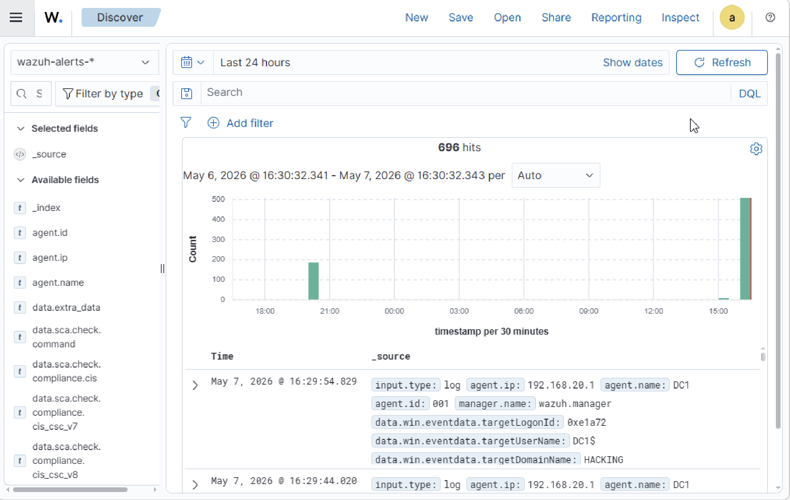

# Wazuh 4.14.5 Installation on UTM (Apple Silicon (M1/M2/M3/M4/M5)/ macOS)

## Overview

This guide explains how to deploy a fully working Wazuh SIEM environment on UTM using Docker after the native installation failed due to virtualization limitations.

Environment used:

* macOS + UTM
* Ubuntu Server 22.04.5 LTS
* Wazuh 4.14.5
* Docker deployment (single-node)
* Internal network: `192.168.20.0/24`

---

# Problem Encountered

The native Wazuh installation using:

```bash
bash wazuh-install.sh -a
```

failed during the Wazuh Indexer startup.

Main error:

```text
wazuh-indexer.service: Failed with result 'signal'
```

Java/OpenSearch also generated JVM crashes.

---

# Root Cause

The issue was related to virtualization support on UTM.

Checking CPU virtualization:

```bash
egrep -c '(vmx|svm)' /proc/cpuinfo
```

Result:

```text
0
```

This means nested virtualization was unavailable inside the VM, causing the native Wazuh Indexer/OpenSearch service to fail.

---

# Solution

Instead of using the native installation, Wazuh was deployed using Docker containers.

This bypasses the JVM/indexer issue and works correctly on UTM.

---

# Requirements

Ubuntu VM:

* 4 vCPUs
* 8 GB RAM
* Internet access
* Docker installed

---

# Docker Installation

Update the system:

```bash
sudo apt update && sudo apt upgrade -y
```

Install Docker:

```bash
curl -fsSL https://get.docker.com | sh
```

Enable Docker:

```bash
systemctl enable docker
systemctl start docker
```

Verify:

```bash
docker --version
```

---

# Install Docker Compose

```bash
sudo apt install docker-compose -y
```

Verify:

```bash
docker-compose --version
```

---

# Clone Wazuh Docker Repository

```bash
cd /home/user

git clone https://github.com/wazuh/wazuh-docker.git
```

Checkout the correct version:

```bash
cd wazuh-docker

git checkout v4.14.5
```

---

# Generate Certificates

```bash
cd single-node
```

Generate certificates:

```bash
docker-compose -f generate-indexer-certs.yml run --rm generator
```

Expected result:

```text
Wazuh dashboard certificates created.
```

---

# Start Wazuh Stack

```bash
docker-compose up -d
```

Verify containers:

```bash
docker ps
```

Expected containers:

* wazuh.dashboard
* wazuh.manager
* wazuh.indexer

---

# Access Dashboard

Open:

```text
https://192.168.20.2
```

Default credentials:

```text
Username: admin
Password: SecretPassword
```

---

# Important Ports

| Service             | Port  |
| ------------------- | ----- |
| Dashboard           | 443   |
| API                 | 55000 |
| Agent communication | 1514  |
| Agent registration  | 1515  |
| Indexer             | 9200  |

---

# Windows Agent Installation

## Network Setup

The Windows VM required:

* One NAT adapter (internet access)
* One Host-Only adapter (communication with Wazuh)

---

## Install Agent

Run PowerShell as Administrator:

```powershell
Invoke-WebRequest -Uri https://packages.wazuh.com/4.x/windows/wazuh-agent-4.14.5-1.msi -OutFile $env:tmp\wazuh-agent.msi

msiexec.exe /i $env:tmp\wazuh-agent.msi /q WAZUH_MANAGER='192.168.20.2' WAZUH_AGENT_GROUP='Servers' WAZUH_AGENT_NAME='DC1'
```

Start the service:

```powershell
NET START WazuhSvc
```

---

# Common Issues

## Dashboard shows:

```text
Wazuh dashboard server is not ready yet
```

Wait 1–3 minutes for all containers to initialize.

---

## DNS Error on Windows

```text
The remote name could not be resolved
```

Fix DNS:

```powershell
Set-DnsClientServerAddress -InterfaceAlias "Ethernet" -ServerAddresses 8.8.8.8,1.1.1.1
```

---

# Final Result

## Dashboard & Event Monitoring




The Docker deployment successfully provided:

* Working Wazuh Dashboard
* Functional Indexer
* Active Manager/API
* Windows agent integration
* Stable deployment on UTM/macOS

This deployment demonstrates a practical workaround for virtualization limitations commonly encountered in Apple Silicon + UTM environments.
