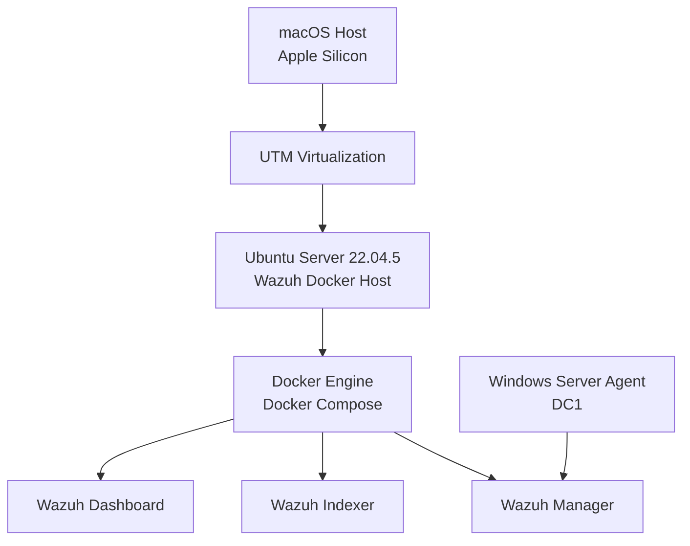

# Wazuh 4.14.5 SIEM Deployment on UTM / Apple Silicon

## Overview

This project documents the deployment of a **Wazuh 4.14.5 SIEM environment** on an Ubuntu Server virtual machine running on **UTM for macOS Apple Silicon**.

The lab demonstrates a practical workaround for virtualization limitations encountered when installing Wazuh natively inside UTM. Instead of using the native installer, Wazuh was successfully deployed using the official Docker-based single-node deployment.

---

## Lab Environment

| Component | Configuration |
|----------|---------------|
| Host System | macOS on Apple Silicon |
| Virtualization | UTM |
| Guest OS | Ubuntu Server 22.04.5 LTS |
| SIEM Platform | Wazuh 4.14.5 |
| Deployment Method | Docker Compose |
| Architecture | Single-node |
| Internal Network | `192.168.20.0/24` |

---

## Architecture



---

## Problem Encountered

The native Wazuh installation was initially attempted using:

```bash
bash wazuh-install.sh -a
```

However, the installation failed during the Wazuh Indexer startup.

Main error:

```text
wazuh-indexer.service: Failed with result 'signal'
```

The system also generated Java/OpenSearch JVM crash errors.

---

## Root Cause Analysis

CPU virtualization support was checked inside the Ubuntu virtual machine:

```bash
egrep -c '(vmx|svm)' /proc/cpuinfo
```

Result:

```text
0
```

This confirmed that nested virtualization support was not available inside the UTM virtual machine.

As a result, the native Wazuh Indexer/OpenSearch service failed to start correctly in this environment.

---

## Solution Implemented

To bypass the native installation issue, Wazuh was deployed using Docker containers.

This approach provided a stable and functional Wazuh environment on UTM while avoiding the virtualization-related problems affecting the native indexer service.

---

## System Requirements

| Requirement | Value |
|------------|-------|
| CPU | 4 vCPUs |
| Memory | 8 GB RAM |
| Disk | 50 GB or higher recommended |
| Network | Internet access |
| Container Runtime | Docker |
| Orchestration | Docker Compose |

---

## Docker Installation

Update the system:

```bash
sudo apt update && sudo apt upgrade -y
```

Install Docker:

```bash
curl -fsSL https://get.docker.com | sh
```

Enable and start Docker:

```bash
sudo systemctl enable docker
sudo systemctl start docker
```

Verify Docker installation:

```bash
docker --version
```

---

## Docker Compose Installation

Install Docker Compose:

```bash
sudo apt install docker-compose -y
```

Verify installation:

```bash
docker-compose --version
```

---

## Wazuh Docker Deployment

Clone the Wazuh Docker repository:

```bash
cd /home/user
git clone https://github.com/wazuh/wazuh-docker.git
```

Enter the repository:

```bash
cd wazuh-docker
```

Checkout the required version:

```bash
git checkout v4.14.5
```

Enter the single-node deployment directory:

```bash
cd single-node
```

Generate certificates:

```bash
docker-compose -f generate-indexer-certs.yml run --rm generator
```

Expected output:

```text
Wazuh dashboard certificates created.
```

Start the Wazuh stack:

```bash
docker-compose up -d
```

Verify running containers:

```bash
docker ps
```

Expected containers:

| Container | Purpose |
|----------|---------|
| wazuh.manager | Wazuh manager and API |
| wazuh.indexer | Event indexing and storage |
| wazuh.dashboard | Web dashboard |

---

## Dashboard Access

The Wazuh Dashboard can be accessed through:

```text
https://192.168.20.2
```

Default credentials:

```text
Username: admin
Password: SecretPassword
```

> Note: Default credentials should be changed in production environments.

---

## Important Ports

| Service | Port | Purpose |
|--------|------|---------|
| Dashboard | 443 | Web interface |
| Wazuh API | 55000 | API access |
| Agent Communication | 1514 | Agent event forwarding |
| Agent Registration | 1515 | Agent enrollment |
| Indexer | 9200 | Indexer API |

---

## Windows Agent Integration

A Windows Server agent was installed to forward logs and security events to the Wazuh Manager.

### Network Setup

The Windows virtual machine used:

| Adapter | Purpose |
|--------|---------|
| NAT | Internet access |
| Host-Only | Communication with Wazuh |

---

### Agent Installation

Run PowerShell as Administrator:

```powershell
Invoke-WebRequest -Uri https://packages.wazuh.com/4.x/windows/wazuh-agent-4.14.5-1.msi -OutFile $env:tmp\wazuh-agent.msi
```

Install the agent:

```powershell
msiexec.exe /i $env:tmp\wazuh-agent.msi /q WAZUH_MANAGER='192.168.20.2' WAZUH_AGENT_GROUP='Servers' WAZUH_AGENT_NAME='DC1'
```

Start the Wazuh agent service:

```powershell
NET START WazuhSvc
```

---

## Troubleshooting

### Wazuh Dashboard Not Ready

Error:

```text
Wazuh dashboard server is not ready yet
```

Cause:

The Wazuh containers may still be initializing.

Solution:

Wait a few minutes and verify container status:

```bash
docker ps
```

You can also inspect logs with:

```bash
docker logs wazuh.dashboard
docker logs wazuh.manager
docker logs wazuh.indexer
```

---

### DNS Resolution Error on Windows

Error:

```text
The remote name could not be resolved
```

Solution:

Configure external DNS servers:

```powershell
Set-DnsClientServerAddress -InterfaceAlias "Ethernet" -ServerAddresses 8.8.8.8,1.1.1.1
```

---

## Validation

The deployment was validated by confirming:

| Test | Result |
|------|--------|
| Docker service running | ✅ Passed |
| Wazuh containers running | ✅ Passed |
| Wazuh Dashboard accessible | ✅ Passed |
| Wazuh Manager operational | ✅ Passed |
| Wazuh Indexer operational | ✅ Passed |
| Windows agent installed | ✅ Passed |
| Windows agent connected | ✅ Passed |
| Security events visible in dashboard | ✅ Passed |

---

## Final Result

The Wazuh Docker deployment successfully provided a functional SIEM environment on UTM and macOS Apple Silicon.

Implemented components:

| Component | Status |
|----------|--------|
| Wazuh Dashboard | ✅ Operational |
| Wazuh Manager | ✅ Operational |
| Wazuh Indexer | ✅ Operational |
| Docker Deployment | ✅ Operational |
| Windows Agent | ✅ Integrated |
| Event Monitoring | ✅ Functional |

---

## Dashboard Preview


---

## Skills Demonstrated

- SIEM Deployment
- Wazuh Administration
- Docker Compose
- Linux Server Administration
- Troubleshooting
- Windows Agent Integration
- Log Collection
- Security Monitoring
- Virtualization on Apple Silicon
- Infrastructure Documentation

---

## Conclusion

This project demonstrates how to deploy a fully functional Wazuh SIEM environment on UTM running on Apple Silicon.

The native installation failed due to virtualization limitations, but the Docker-based deployment provided a stable and practical alternative. This approach allowed the successful integration of a Windows Server agent and enabled centralized security monitoring inside the lab environment.
